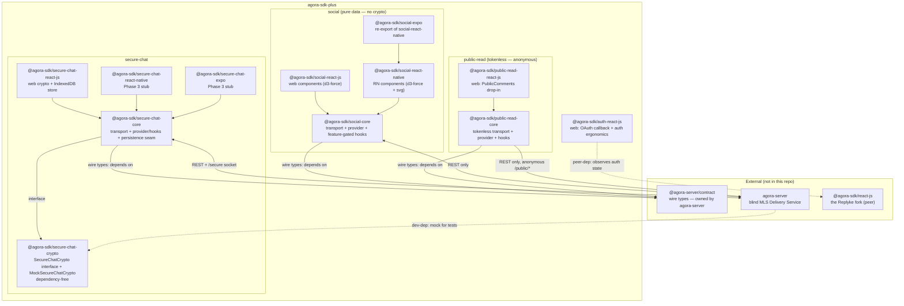
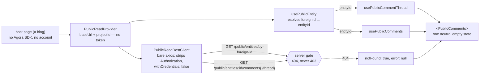
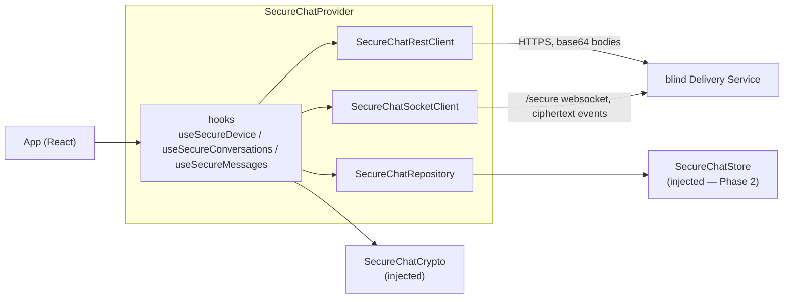
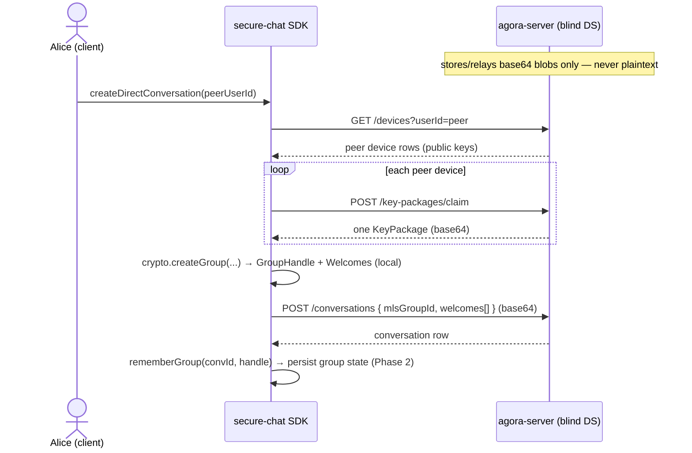
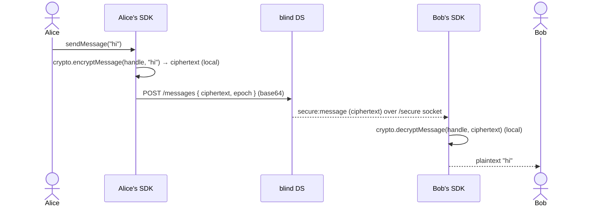
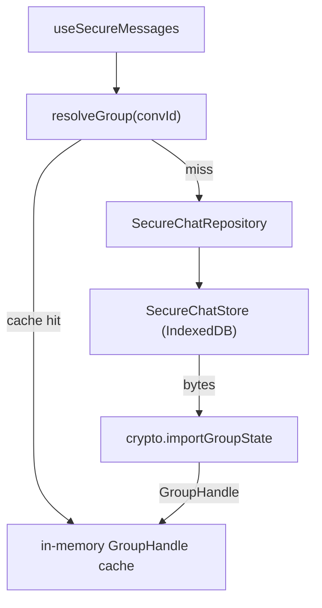

# Architecture (visual)

The **diagram companion** to [`CLAUDE.md`](CLAUDE.md). CLAUDE.md owns the prose — *why* the repo
exists, the fork/contributor model, and which package owns what. This file owns the **pictures**: the
package graph, the layers/seams, and the runtime flows. When the two disagree, CLAUDE.md wins; fix the
diagram.

For the present-state ledger see [`STATUS.md`](STATUS.md); for the phase checklist see
[`packages/secure-chat/ROADMAP.md`](packages/secure-chat/ROADMAP.md); the canonical spec is
agora-server's `docs/SECURE_CHAT.md`.

## The one idea

The Agora server is a **blind MLS Delivery Service**: it stores and relays opaque base64 blobs
(KeyPackages, Welcomes, Commits, application ciphertext, key backups) and **never sees plaintext**.
**All MLS (RFC 9420) crypto lives client-side**, in these packages, behind the `SecureChatCrypto`
seam. Everything below is in service of that.

## Package graph



The arrows worth memorizing: **SDK → contract** (never the reverse) — true for *both* `secure-chat-core`
and `social-core`; and **server → crypto** is *test-only* (agora-server dev-depends on the mock; it
ships none of this crypto). The lone outbound **`auth-react-js` ⇢ `@agora-sdk/react-js`** peer-dep is
the single deliberate exception to "no `@agora-sdk/core` dependency" — auth is about the SDK session;
secure-chat / social stay standalone (`baseUrl` + token in). Note the two feature groups never touch
each other: social is **pure data** — no `secure-chat-crypto`, no `/secure` socket.

**`public-read` is the extreme case of the standalone rule** — read its box as much for the arrows it
*lacks* as the one it has. It depends on `@agora-server/contract` for types and on nothing else in
this repo or the fork; it takes no access token at all, only `baseUrl` + `projectId`. That absence is
the architecture: a third-party blog with no Agora SDK installed can render a thread, and no code path
exists that could attach a credential to a surface whose wildcard CORS would reject one.

## Public-read layers & seams



Two seams carry the security posture. **The token seam does not exist** — `PublicReadRestConfig` has
no credential field, so tokenlessness is a type-level guarantee rather than a convention. And **the
`notFound` seam** keeps the gate's deliberate ambiguity intact end to end: a `404` becomes a boolean,
never an `Error` with a message, so no renderer can leak a guess between unpublished / missing /
draft / removed / space-went-private. The `foreignId → entityId` hop is drawn explicitly because the
comment routes are uuid-only — the SDK mirrors the server's addressing rather than inventing one.

## Layers & seams (inside the SDK)

Two things are **dependency-injected** so core stays platform- and library-agnostic: the **crypto**
(mock in tests; the real **ts-mls** core on web via `@agora-sdk/secure-chat-crypto/ts-mls`; native
later) and the **store** (in-memory by default; IndexedDB on web).



## Social graph layers & seams

The social group has **no DI** — no crypto seam, no store seam, no socket. `SocialProvider` takes
`baseUrl` + token + `projectId`, fetches the **transparency config** once on mount, and exposes it so
every hook and component **self-gates** (a disabled lens renders nothing rather than calling its
endpoint). Three member-facing lenses + the transparency view, each one REST call:

```mermaid
flowchart LR
  app["App (React)"]

  subgraph "SocialProvider"
    cfg["transparency config<br/>(fetched on mount → gates everything)"]
    wHook["useSocialWeather"]
    cHook["useSocialConstellation"]
    nHook["useSocialNeighborhood"]
    tHook["useSocialTransparency"]
    srest["social REST client"]
  end

  ds["agora-server<br/>(aggregates / k-anonymous / self-view)"]

  app --> wHook & cHook & nHook & tHook
  cfg -.->|gate| wHook & cHook & nHook
  wHook & cHook & nHook & tHook --> srest
  srest -->|GET /social/{weather,constellation,neighborhood,transparency}| ds
```

Privacy tiers are enforced **server-side** (Weather = aggregate scalar, Constellation = k-anonymous
cluster blobs, Neighborhood = caller's self-view only); the SDK renders what it's handed and never
re-identifies. Lens-by-lens detail in [`docs/SOCIAL-GRAPH.md`](docs/SOCIAL-GRAPH.md).

## Runtime flows

### Start a direct message



### Send & receive



The durable path is always REST (`GET .../messages`, `GET .../handshakes?since=`); the socket is a
notification optimization. Offline catch-up replays from the cursors.

## Persistence (Phase 2)

Group/device state must survive a reload — so the provider builds a typed `SecureChatRepository` over
the injected `SecureChatStore`, plus a cached `resolveGroup`. Detailed design (and its own diagrams)
in [`docs/superpowers/specs/2026-06-06-secure-chat-persistence-design.md`](docs/superpowers/specs/2026-06-06-secure-chat-persistence-design.md).


