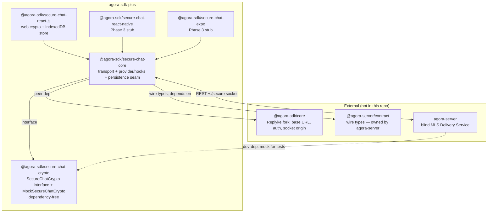
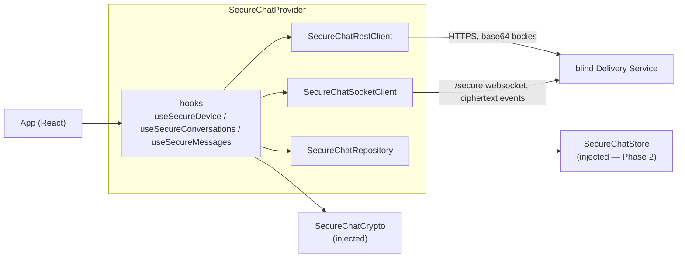
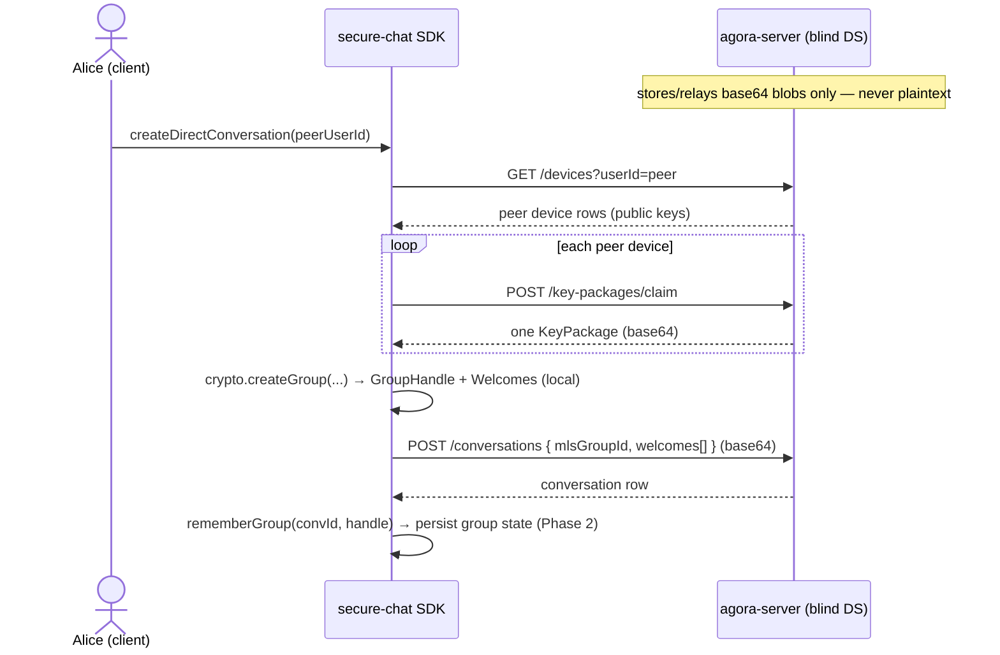
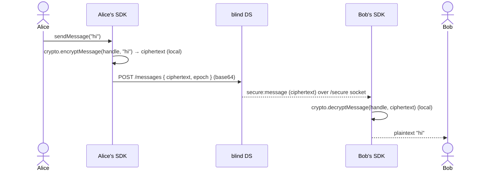
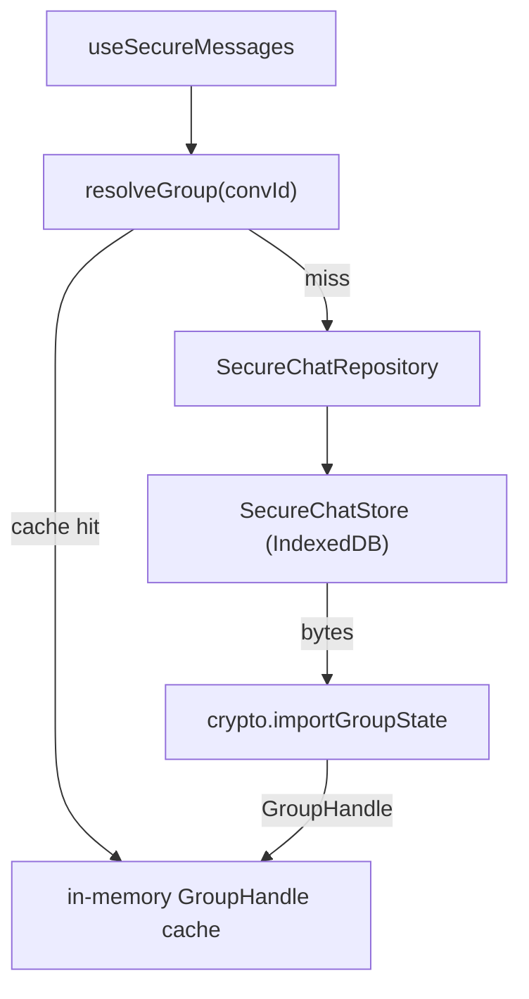

# Architecture (visual)

The **diagram companion** to [`CLAUDE.md`](CLAUDE.md). CLAUDE.md owns the prose — *why* the repo
exists, the fork/contributor model, and which package owns what. This file owns the **pictures**: the
package graph, the layers/seams, and the runtime flows. When the two disagree, CLAUDE.md wins; fix the
diagram.

For the present-state ledger see [`STATUS.md`](STATUS.md); for the phase checklist see
[`packages/secure-chat/ROADMAP.md`](packages/secure-chat/ROADMAP.md); the canonical spec is
agora-server's `docs/SECURE_CHAT.md`.

## The one idea

The Agora server is a **blind MLS Delivery Service**: it stores and relays opaque base64 blobs
(KeyPackages, Welcomes, Commits, application ciphertext, key backups) and **never sees plaintext**.
**All MLS (RFC 9420) crypto lives client-side**, in these packages, behind the `SecureChatCrypto`
seam. Everything below is in service of that.

## Package graph

The two arrows worth memorizing: **SDK → contract** (never the reverse), and **server → crypto** is
*test-only* (agora-server dev-depends on the mock; it ships none of this crypto).

## Layers & seams (inside the SDK)

Two things are **dependency-injected** so core stays platform- and library-agnostic: the **crypto**
(mock in tests; the real **ts-mls** core on web via `@agora-sdk/secure-chat-crypto/ts-mls`; native
later) and the **store** (in-memory by default; IndexedDB on web).

## Runtime flows

### Start a direct message

### Send & receive

The durable path is always REST (`GET .../messages`, `GET .../handshakes?since=`); the socket is a
notification optimization. Offline catch-up replays from the cursors.

## Persistence (Phase 2)

Group/device state must survive a reload — so the provider builds a typed `SecureChatRepository` over
the injected `SecureChatStore`, plus a cached `resolveGroup`. Detailed design (and its own diagrams)
in [`docs/superpowers/specs/2026-06-06-secure-chat-persistence-design.md`](docs/superpowers/specs/2026-06-06-secure-chat-persistence-design.md).

